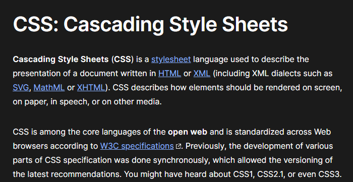
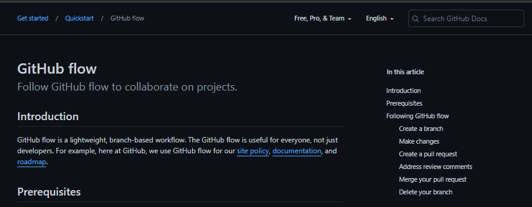

# 02-Challenge

## Description

This application contains my current portfolio of past and present applications as they may be accessed by potential employers.

## Table of Contents

- [Website Preview](#website-preview)
- [Site Features](#site-features)
- [Acceptance Criteria](#acceptance-criteria-for-this-application)
- [Credits](#credits)
    - [CSS Information](#css-information)
    - [CSSBox Information](#cssbox-information)
    - [Git Cheat Sheet](#git-cheat-sheet-pdf)
    - [Git Flow Process](#git-flow-process)
    - [HTML Reference](#html-reference)
    - [Java Basics](#java-basics)
    - [Java Data Types](#java-data-types)
- [License](#license)
- [How To Contribute](#how-to-contribute)

# Website Preview

[Mark Battaglia c0d1ng Portfolio](https://estee3.github.io/03-Challenge/)

## Site Features
- Static header so that all links to in-site sections are always available
- Animated gif for marquee, to add a bit of visual flare to the site
- Gradient background coloring for the entire site
- Added "glow" to the header and footer so that the feel of the site is more cohesive
- Site displays well across all device types, regardless of display width

# Acceptance Criteria for this Application
### GIVEN I need to sample a potential employee's previous work

- WHEN I load their portfolio
    - THEN I am presented with the developer's name, a recent photo or avatar, and links to sections about them, their work, and how to contact them
- WHEN I click one of the links in the navigation
    - THEN the UI scrolls to the corresponding section
- WHEN I click on the link to the section about their work
    - THEN the UI scrolls to a section with titled images of the developer's applications
- WHEN I am presented with the developer's first application
    - THEN that application's image should be larger in size than the others
- WHEN I click on the images of the applications
    - THEN I am taken to that deployed application
- WHEN I resize the page or view the site on various screens and devices
    - THEN I am presented with a responsive layout that adapts to my viewport

## Credits
NOTE: Click preview pictures to navigate to the referenced site

### CSS Information

### CSSBox Information

### Git Cheat Sheet (pdf)

### Git Flow Process

### HTML Reference

## License

MIT License

Copyright (c) [year] [fullname]

Permission is hereby granted, free of charge, to any person obtaining a copy
of this software and associated documentation files (the "Software"), to deal
in the Software without restriction, including without limitation the rights
to use, copy, modify, merge, publish, distribute, sublicense, and/or sell
copies of the Software, and to permit persons to whom the Software is
furnished to do so, subject to the following conditions:

The above copyright notice and this permission notice shall be included in all
copies or substantial portions of the Software.

THE SOFTWARE IS PROVIDED "AS IS", WITHOUT WARRANTY OF ANY KIND, EXPRESS OR
IMPLIED, INCLUDING BUT NOT LIMITED TO THE WARRANTIES OF MERCHANTABILITY,
FITNESS FOR A PARTICULAR PURPOSE AND NONINFRINGEMENT. IN NO EVENT SHALL THE
AUTHORS OR COPYRIGHT HOLDERS BE LIABLE FOR ANY CLAIM, DAMAGES OR OTHER
LIABILITY, WHETHER IN AN ACTION OF CONTRACT, TORT OR OTHERWISE, ARISING FROM,
OUT OF OR IN CONNECTION WITH THE SOFTWARE OR THE USE OR OTHER DEALINGS IN THE
SOFTWARE.

---

## How to Contribute

[Contributor Covenant](https://www.contributor-covenant.org/)

User Story
AS AN employer
I WANT to view a potential employee's deployed portfolio of work samples
SO THAT I can review samples of their work and assess whether they're a good candidate for an open position
Acceptance Criteria
Here are the critical requirements necessary to develop a portfolio that satisfies a typical hiring manager's needs:

GIVEN I need to sample a potential employee's previous work
WHEN I load their portfolio
THEN I am presented with the developer's name, a recent photo or avatar, and links to sections about them, their work, and how to contact them
WHEN I click one of the links in the navigation
THEN the UI scrolls to the corresponding section
WHEN I click on the link to the section about their work
THEN the UI scrolls to a section with titled images of the developer's applications
WHEN I am presented with the developer's first application
THEN that application's image should be larger in size than the others
WHEN I click on the images of the applications
THEN I am taken to that deployed application
WHEN I resize the page or view the site on various screens and devices
THEN I am presented with a responsive layout that adapts to my viewport
Mock-Up
The following animation shows the web application's appearance and functionality:

### Sample portfolio

How to Complete the Challenge
Follow these steps to complete the challenge:

Use the Acceptance Criteria as a guide for how you'll plan deadlines, sketch, and code your portfolio.

Ensure that your work meets the Acceptance Criteria and the full list of grading requirements.

Reach out to your instructional support team throughout the week for help.

Follow submission instructions.

Grading Requirements
NOTE
If a Challenge assignment submission is marked as “0”, it is considered incomplete and will not count towards your graduation requirements. Examples of incomplete submissions include the following:

A repository that has no code

A repository that includes a unique name but nothing else

A repository that includes only a README file but nothing else

A repository that only includes starter code

This Challenge is graded based on the following criteria:

Technical Acceptance Criteria: 40%
Satisfies all of the preceding acceptance criteria.
Deployment: 32%
Application deployed at live URL.

Application loads with no errors.

Application GitHub URL submitted.

GitHub repository contains application code.

Application Quality: 15%
Application resembles the mock-up functionality provided in the Challenge instructions.
Repository Quality: 13%
Repository has a unique name.

Repository follows best practices for file structure and naming conventions.

Repository follows best practices for class/id naming conventions, indentation, quality comments, etc.

Repository contains multiple descriptive commit messages.

Repository contains a quality readme with description, screenshot, link to deployed application.

How to Submit the Challenge
You are required to submit BOTH of the following for review:

The URL of the deployed application.

The URL of the GitHub repository that contains your code. Give the repository a unique name and include a README file that describes the project.

NOTE
You are allowed to miss up to two Challenge assignments and still earn your certificate. If you complete all Challenge assignments, your lowest two grades will be dropped. If you wish to skip this assignment, click Next, and move on to the next Module.

Comments are disabled for graded submissions in BootCamp Spot. If you have questions about your feedback, please notify your instructional staff or the Student Success Manager. If you would like to resubmit your work for an improved grade, you can use the Resubmit Assignment button to upload new links. You may resubmit up to three times for a total of four submissions.

